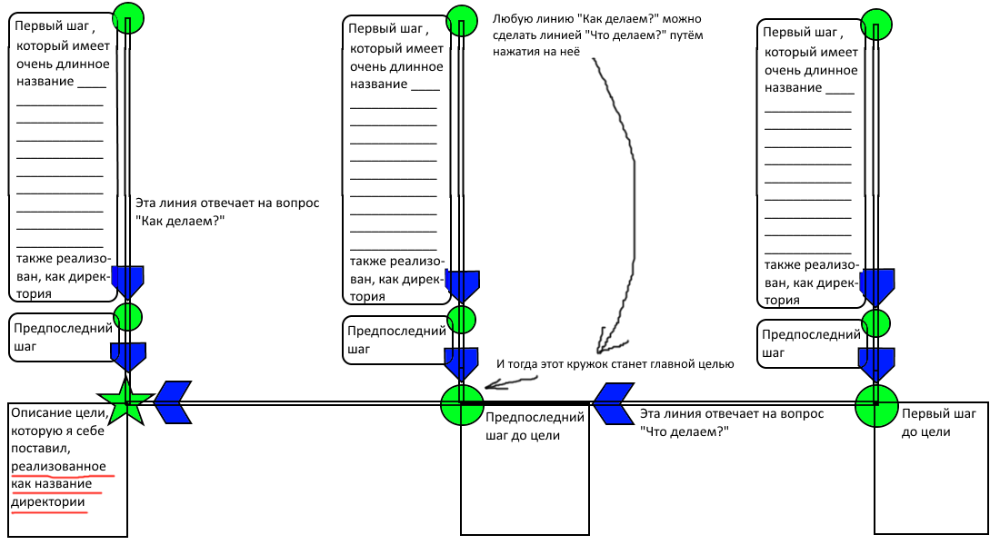
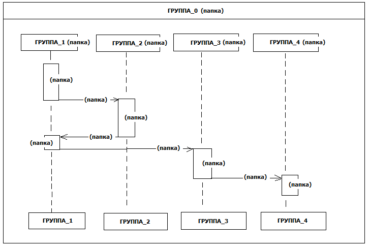
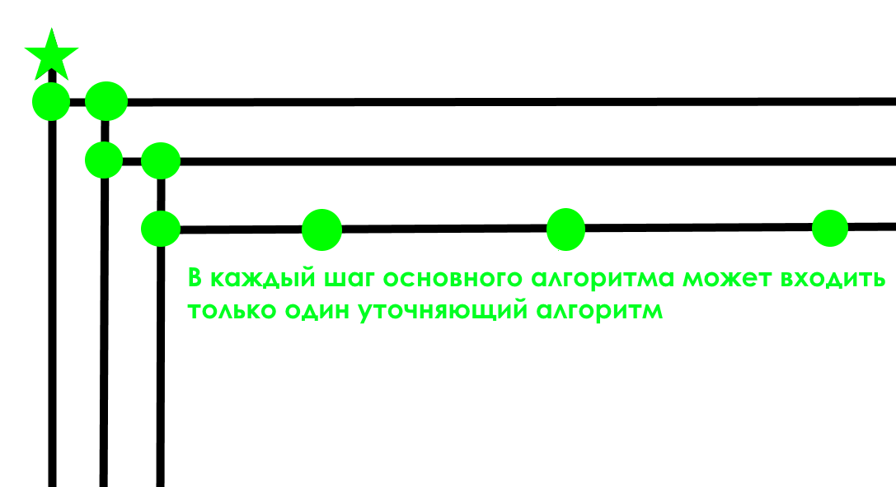
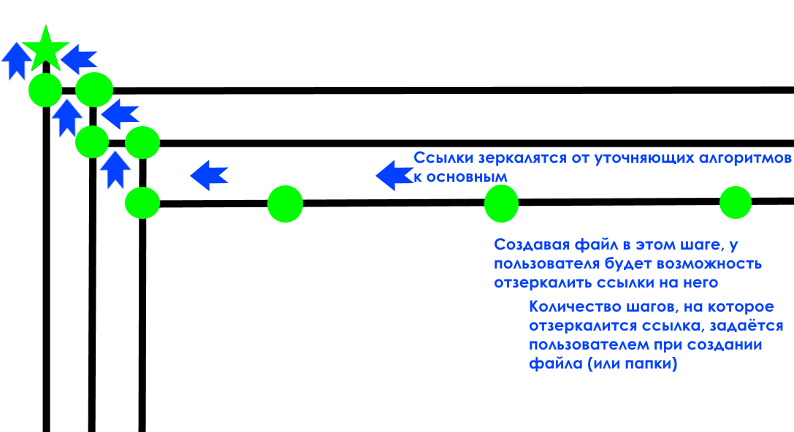
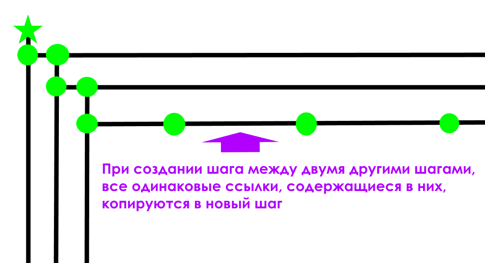

Вид при входе в программу (будет совершенно другой вид и содержание, но смысл узлов графа как папок остаётся)

Вид при входе в программу (будет совершенно другой вид и содержание, но смысл узлов графа как папок остаётся)

ВАЖНО: смутное видение дальнейшего пути развития программы... На базе этого файлового менеджера есть мысли по созданию веб-клиента для публичной карты алгоритмов, но как реализовать визуал этой карты - пока не ясно: одна из проблем - это объединение схожих по смыслу объектов алгоритма в один, имея разные пользовательские названия одного и того же объекта. Также придётся сталкиваться с теми же проблемами, с которыми сталкивается Википедия - вандализм, злоупотребления, безопасность данных. Если быть реалистом, то в этом направлении лучше не идти.

###Собственно программа

Представьте, что вы планируете реализовать какую-то цель, и вам не хочется в процессе работы отвлекаться на каталогизацию ваших папок и файлов. Вам требуется прямой контакт с файлами и нет времени и желания раскидывать их по папкам.

В таком случае можно просто обозначить для этих папок и файлов общую директорию.

Но где начинается магия моей программы?

Вы создаёте некий алгоритм достижения цели, шаги которого будут реализованы как папки. В этих шагах будут храниться ссылки на папки и файлы из общей директории. Магия будет заключаться в том, что пользователь будет работать в этих шагах алгоритма, создавая новые файлы и папки в этих шагах, затем эти файлы и папки перемещаются программой в общую директорию, а ссылки на них остаются в шагах алгоритма. А что самое главное - это то, что, создавая эти новые файлы и папки, пользователь имеет возможность указать, во скольких соседних с данным шагом шагах отзеркалится ссылка на наш файл или папку.

Пример из жизни.

У нас есть ракета. Цель - орбита. Алгоритм - это траектория полёта до орбиты. Шаги алгоритма - это ступени ракеты, которые пользователь отбрасывает, когда работа обрастает слишком большим количеством файлов и/или шаг алгоритма исчерпал себя и требуется приступить к работе в следующем шаге алгоритма. НО, так как на прошлом  шаге некоторые важные ссылки были отзеркалены в этот шаг, то работа начинается уже не с ноля, а с какого-то фундамента.

А вишенка на торте - это то, что программа будет уметь доставать файлы из общей директории по ссылкам на них. Это значит, что я могу просто скопировать свой шаг со ссылками куда угодно, и программа поймёт, что я хочу скопировать именно файлы, а не ссылки.

## Структурированная концепция моей программы:

Проблема:  Традиционные файловые системы требуют постоянной каталогизации, что отвлекает от реализации цели.

Решение: Программа с двумя основными компонентами:

1. "Общая директория":  Место для хранения всех файлов и папок без структурирования.
2. "Алгоритм достижения цели": 
    * Представлен в виде последовательности шагов (папок).
    * Каждый шаг содержит ссылки на файлы и папки из "Общей директории", релевантные для этого этапа работы.
    * Пользователь работает внутри шагов алгоритма, не заботясь о структурировании файлов.
    * Магия: 
        * Все созданные в шагах файлы автоматически переносятся в "Общую директорию". 
        * Ссылки на них остаются в шаге алгоритма.
        * Пользователь может задавать "радиус зеркалирования"  - сколько соседних шагов получат ссылку на новый файл/папку.
    * "Переход между шагами":  По завершению шага, пользователь переходит в следующий шаг,  важные ссылки  в нём уже присутствуют, обеспечивая непрерывность работы.

"Вишенка на торте":  
* Программа умеет "распаковывать" ссылки - при копировании шага алгоритма копируются  сами файлы, а не ссылки.

Аналогия:  
* Ракета: Программа.
* Цель: Орбита (конечная цель пользователя).
* Траектория: Алгоритм достижения цели.
* Ступени: Шаги алгоритма.
* "Зеркалирование":  Дублирование важных компонентов на следующие и/или предыдущие ступени.

Преимущества:

*  Фокус на цели:  Пользователь  сосредоточен на работе, а не на каталогизации.
* Гибкость:   Алгоритм  адаптируется под рабочий процесс.
* Переносимость:  Шаги  легко копируются  с сохранением доступа ко всем файлам.

В целом:  Моя программа предлагает новый подход к управлению файлами, оптимизируя рабочий процесс и освобождая пользователя от рутинной каталогизации.

